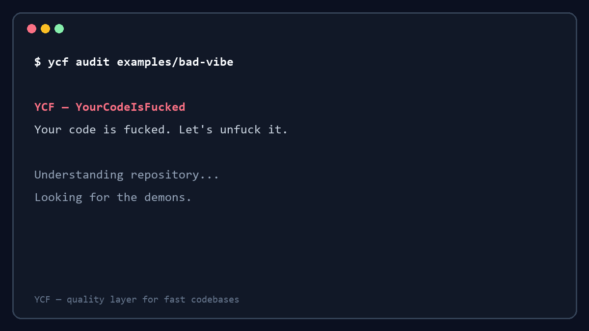

# YCF — YourCodeIsFucked

> **Your code is fucked. Let's unfuck it.**
>
> **Tu código está jodido. Vamos a arreglarlo.**

<details>
<summary>Read in another language</summary>

[Español](README.es.md) · [Português](README.pt.md) · [Français](README.fr.md) · [Deutsch](README.de.md) · [Italiano](README.it.md) · [العربية](README.ar.md) · [中文](README.zh.md)
</details>

## Use whatever you want.

Claude Code · Codex · Cursor · Copilot · Gemini · Lovable · Bolt · Your own hands

```text
                  build fast
                      ↓
         YCF — the quality layer
                      ↓
                ship clean code
```

**We don't detect AI code. We detect bad code.**

**No detectamos código escrito por IA. Detectamos código malo.**

YCF is a free, open-source CLI for understanding a codebase, finding measurable engineering problems, safely cleaning confirmed residue, planning structural improvements and verifying that nothing broke. It is for the vibe coder with a great idea, the senior developer with six agent windows open, and the team that needs quality gates before shipping.

Vibe coding is fun. Cleaning up after it is not.

## Start here

```bash
npm install -g @jotaese68/ycf-cli
cd your-project

# Look first. YCF will not change your source code.
ycf audit
ycf map

# Open the first visual architecture map locally.
ycf map --html

# Ask what a change to one module can affect (read-only).
ycf impact src/checkout.ts .

# Generate the local visual cockpit.
ycf cockpit .

# See the plan before allowing a change.
ycf unfuck --dry-run
```

When you agree with the plan, use `--yes`. YCF creates a Git checkpoint before safe cleanup, verifies the result and rolls back if verification fails.

### See it in five seconds



This is a real run against [`examples/bad-vibe`](examples/bad-vibe): nine findings, a deterministic score and one parser-confirmed safe cleanup candidate. The demo stays read-only until `--yes` is explicitly given.

```bash
ycf cleanup --yes
ycf unfuck --yes
ycf verify
ycf release
```

## What YCF does today

| Command | What it does | Changes code? |
| --- | --- | --- |
| `ycf audit` | Audits a repository and explains risks in your chosen language and level. | No |
| `ycf map` | Generates an architecture map of detected entry points and local module connections. Add `--html` for a self-contained visual map in `.ycf/architecture.html`. | No |
| `ycf impact <module> [target]` | Explains direct/transitive dependencies and dependents before you touch a module. Static imports only; no files changed. | No |
| `ycf cockpit [target]` | Writes a self-contained local HTML cockpit with scores, findings, modules and selectable impact views. | No |
| `ycf ai-residue` | Finds development and AI-residue candidates without changing code or attribution. | No |
| `ycf cleanup --yes` | Removes parser-confirmed debug residue and selected unused named imports with Git safety. | Yes, only after confirmation |
| `ycf unfuck --dry-run` | Shows the current safe pipeline: audit, checkpoint, cleanup, verify and report. | No |
| `ycf refactor` | Produces a supervised refactor plan instead of silently rewriting your architecture. | No |
| `ycf verify` | Runs the available lint, typecheck, test and build scripts. | No |
| `ycf release` | Produces a release-readiness report with audit, map, verification and Git checks. | No |

YCF currently has deterministic diagnostics for JavaScript, TypeScript, React, PHP and WordPress. WordPress checks respect dynamic hooks, filters, shortcodes, REST routes, AJAX, cron and WooCommerce patterns: no lazy “unused means dead” guesses.

## Meet the demons

These are the things YCF hunts. The names are fun; the evidence is not.

| Demon | The boring technical translation |
| --- | --- |
| `DeadCode` | Code or files that need reference analysis before anyone calls them dead. |
| `CopyPaste` | Repeated logic that deserves one clear responsibility. |
| `GodComponent` | A file or component that knows too much, does too much and fears tests. |
| `MysteryHelper` | A helper whose purpose, owner or callers are unclear. |
| `FinalFinalV3` | Development residue, abandoned alternatives and “this time it is final” files. |
| `TODOFromHell` | Old TODOs, temporary fixes and comments that became archaeological sites. |
| `DependencyNobodyUses` | A dependency candidate that needs evidence before it leaves `node_modules`. |

> “It works” is not documentation. Production is not a testing framework.

Every finding should tell you what was found, where it lives, why it matters, its risk, what YCF can safely do and what still needs a human decision. No imaginary metrics. No blind deletion. No pretending `grep` is architecture analysis.

## Serious engineering under the joke

The copy is cheeky. The rules are deliberately conservative.

- `ycf audit` never modifies source code.
- Safe cleanup requires a clean Git worktree, a checkpoint and explicit `--yes`.
- YCF verifies after changes and rolls back if verification fails.
- Authentication, payments, public APIs, database schemas and dynamic framework callbacks are never changed automatically.
- Licenses, copyright notices and required attribution are protected. Cleaning development residue is not hiding where code came from.
- A refactor is a supervised plan until there is enough evidence to do it safely.

Linters find syntax and style problems. YCF is built to expose structural problems and tell you what to do next.

## Why I built this

I used AI to build faster.

And it worked. For a while.

Then I opened projects full of duplicated helpers, “temporary” patches from months ago, folders called `final-final-v3` and components so large they were starting to request collective bargaining.

Everything worked. More or less.

But explaining it to someone else, reviewing it without sweating or handing it over as something professional was another story.

The annoying part? It was my own mess.

I wanted to keep the speed without cleaning the crime scene in secret before anyone looked at the code.

So I built YCF.

Not to pretend code was written by a human. To make sure that, whoever wrote it, it is clear, maintainable, verifiable and ready to ship.

## CLI first. Skills and agents next.

YCF is not just a prompt wrapper or a single agent instruction. Its core is a deterministic CLI: it maps, measures, checks Git safety, writes reports and runs verification. That gives agents something better than a vague opinion: evidence and guardrails.

YCF is designed to work alongside Codex, Claude Code and other coding agents. The read-only `impact` command and local cockpit show the statically visible change surface; agent skills and richer framework-aware impact analysis remain on the roadmap.

## Make it readable for your team

`ycf init` can set the response language and explanation level. English is the default; Spanish, Portuguese, French, German, Italian, Arabic and Chinese are available.

```bash
ycf audit --language es --audience guided
ycf audit --audience professional
```

The engine stays the same. Only the explanation changes: plain guidance for people learning, technical detail for developers, or professional language for reviews and CI.

## Roadmap

The cockpit is the local “wow”: navigate the architecture, filter modules, and ask what may be affected before changing something important.

Next, the cockpit can grow into Audit, Map, Review cleanup, Refactor plan, Verify and Export report panels. Any button that can change code must show its plan and Git diff before it is allowed to act.

## Contributing and security

YCF is Apache-2.0 licensed and open source. See [CONTRIBUTING.md](CONTRIBUTING.md) for contribution guidance and [SECURITY.md](SECURITY.md) to report a vulnerability responsibly.

Created by [Jota Santos](https://www.jsantos.pro/).
